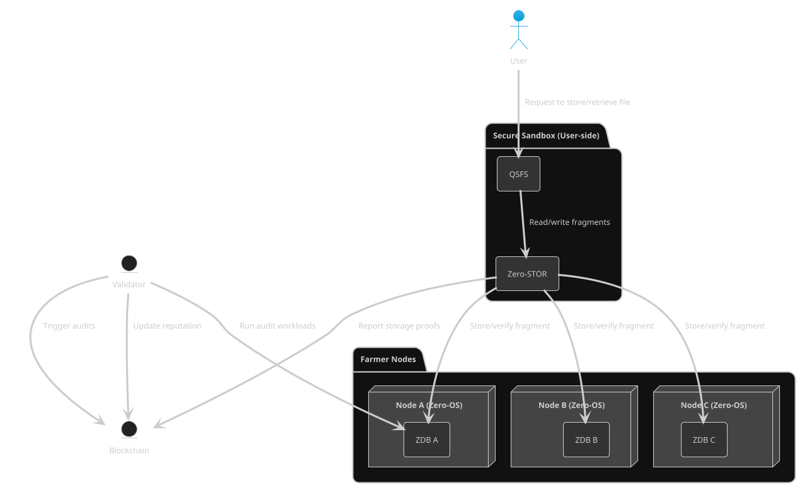

```plantuml
@startuml
!theme bluegray
skinparam backgroundColor transparent
skinparam shadowing false
skinparam componentStyle rectangle

skinparam defaultFontColor #CCCCCC
skinparam ArrowColor #CCCCCC

skinparam package {
  FontColor #CCCCCC
  BorderColor #CCCCCC
  BackgroundColor #111111
}
skinparam node {
  FontColor #CCCCCC
  BorderColor #CCCCCC
  BackgroundColor #444444
}
skinparam component {
  FontColor #CCCCCC
  BorderColor #CCCCCC
  BackgroundColor #333333
}
skinparam entity {
  FontColor #CCCCCC
  BorderColor #CCCCCC
  BackgroundColor #222222
}
skinparam actor {
  FontColor #CCCCCC
}

actor User
package "Secure Sandbox (User-side)" {
  component QSFS as "QSFS"
  component ZeroStor as "Zero-STOR"
}

package "Farmer Nodes" {
  node Node1 as "Node A (Zero-OS)" {
    component ZDB1 as "ZDB A"
  }
  node Node2 as "Node B (Zero-OS)" {
    component ZDB2 as "ZDB B"
  }
  node Node3 as "Node C (Zero-OS)" {
    component ZDB3 as "ZDB C"
  }
}

entity Blockchain
entity Validator

User --> QSFS : Request to store/retrieve file
QSFS --> ZeroStor : Read/write fragments

ZeroStor --> ZDB1 : Store/verify fragment
ZeroStor --> ZDB2 : Store/verify fragment
ZeroStor --> ZDB3 : Store/verify fragment

ZeroStor --> Blockchain : Report storage proofs
Validator --> Blockchain : Trigger audits
Validator --> ZDB1 : Run audit workloads
Validator --> Blockchain : Update reputation

@enduml

```